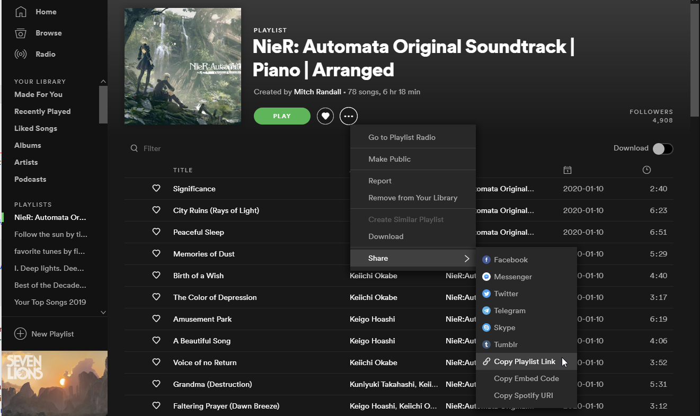

#### Getting start

Pre-requisite: You need Python 3.6+

1. Install using pip 

        pip3 install spotify_dl

2. Login to [Spotify developer console](https://developer.spotify.com/my-applications/#!/applications) and click on "Create an App". Fill in details for name and description

3. Make a note of Client ID and Client Secret. These values need to be then set `SPOTIPY_CLIENT_ID`, `SPOTIPY_CLIENT_SECRET` environment variables respectively.

    You can set environment variables in Linux like so:

            export SPOTIPY_CLIENT_ID=your-spotify-client-id
            export SPOTIPY_CLIENT_SECRET=your-spotify-client-secret

    Windows users, check for [this question](http://superuser.com/a/284351/4377) for details on how you can set environment variables. If you don't wish to use my URL for the redirect, you are free to use any valid URL. Just ensurethe redirect URL set as the environment variable matches with what you have entered in the developer console & in the environment variable above.

4. Create your YouTube API key & fetch the keys from [Google Developer Console](https://console.developers.google.com/apis/api/youtube/overview). Set the key as `YOUTUBE_DEV_KEY` environment variable as mentioned above. Note that as of **version 5 you do not have to set this** - it will fallback to scraping the YouTube page.

        export YOUTUBE_DEV_KEY=youtube-dev-key

5. Run the script using `spotify_dl`. spotify_dl accepts different parameters, for more details run `spotify_dl -h`. 

   For most users `spotify_dl -l spotify_playlist_link -o download_directory -s yes` should do where
   
   - `spotify_playlist_link` is a link to Spotify's playlist. You can get it from the 3-dot menu. 

   

   If the Spotify playlist link is skipped then it will download songs from your "My Music" collection 
   
   - `download_directory` is the location where the songs must be downloaded to. If you give a `.` then it will download to the current directory.
   
6. To retrieve download songs as MP3, you will need to install ffmpeg. If you prefer to skip MP3 conversion, pass `-m` or `--skip_mp3` as a parameter when running the script
  - Linux users can get them by installing libav-tools by using apt-get (`sudo apt-get install -y libav-tools`) or a package manager which comes with your distro
  - Windows users can download FFMPEG pre-built binaries from [here](http://ffmpeg.zeranoe.com/builds/). Extract the file using [7-zip](http://7-zip.org/) to a foldrer and [add the folder to your PATH environment variable](http://www.wikihow.com/Install-FFmpeg-on-Windows) 
  
### Use Docker

Build the Docker image from the Dockerfile, run the following command in the spotify_dl root directory: `docker build -t spotify_dl .`

Run the Docker image with your client ID and secret:
``` bash
docker run -d --rm \
		   -e SPOTIPY_CLIENT_ID=client_id \
		   -e SPOTIPY_CLIENT_SECRET=client_secret \
		   -v "`pwd`":/download \
		   spotify_dl \
		   spotify_dl -l "spotify_playlist_link" -o download_directory
```

You can also run the bulk downloading script, make sure to configure it first: `bash bulk_docker_download.sh`

### How do I set defaults?

You can set defaults per user by creating a file at `~/.spotify_dl_settings`. Create a key with value for every argument you want a default for. Example:
``` json
{
      "output" : "/home/foo/spotify-dl-output"
      , "verbose" : "true"
      , "skip_mp3" : "t"
}
```
